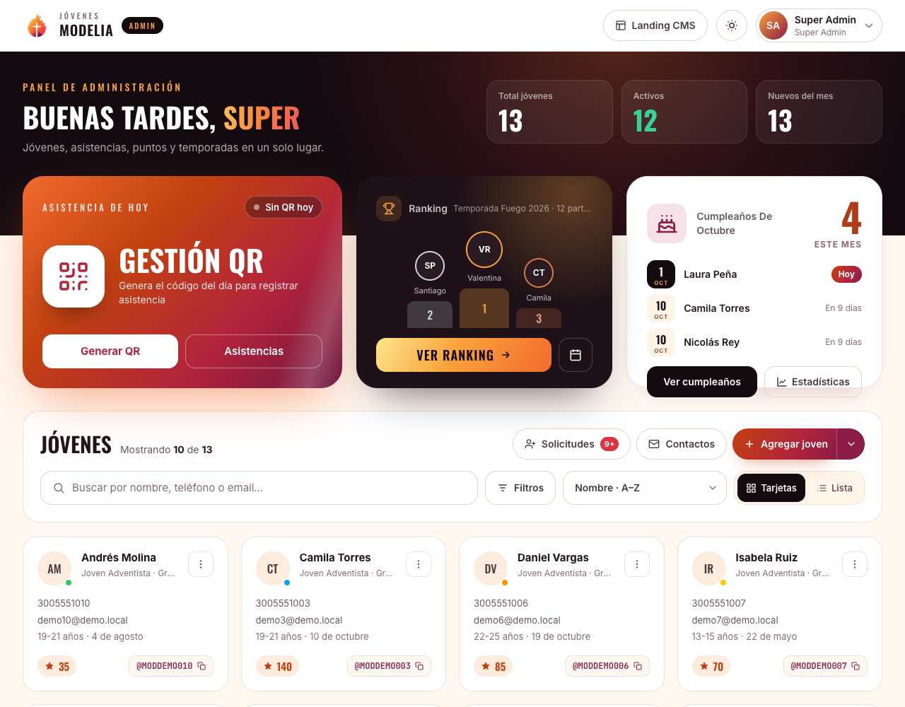
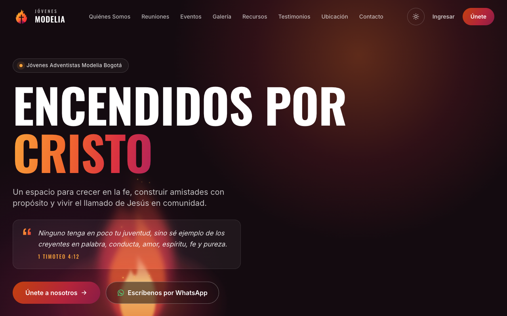
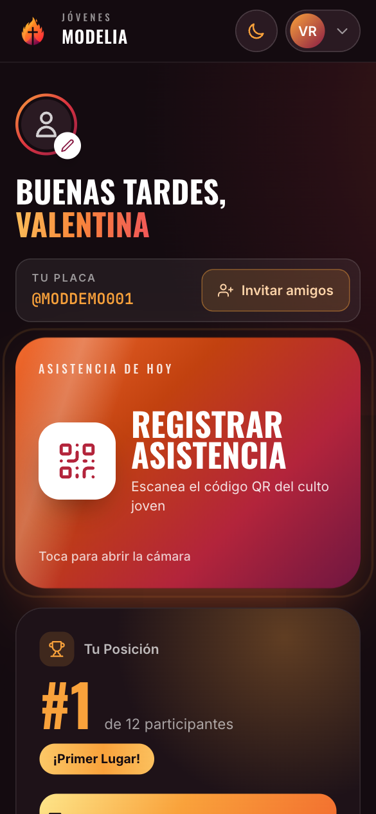
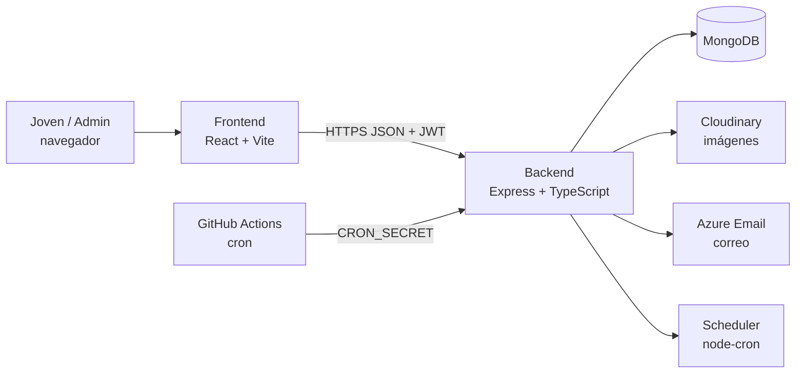
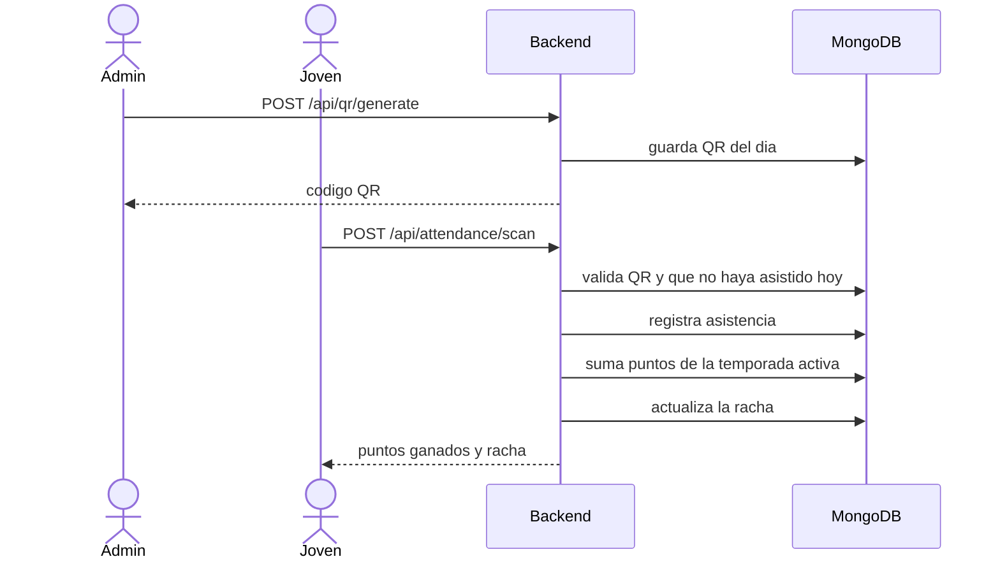

<div align="center">


# JA Manager

**Plataforma de gestión para el grupo de jóvenes Jóvenes Modelia Bogotá: registro de jóvenes, asistencia por QR, puntos y rachas por temporada, landing pública con CMS y flujo de aprobación de solicitudes.**

[](https://github.com/Jvrmmora/ja-manager/actions/workflows/main_ja-backend.yml)


</div>

## Contenido

- [Qué hace](#qué-hace)
- [Cómo funciona](#cómo-funciona)
- [Requisitos](#requisitos)
- [Variables de entorno](#variables-de-entorno)
- [Probarlo en local](#probarlo-en-local)
- [Servicios externos](#servicios-externos)
- [Despliegue](#despliegue)
- [API](#api)
- [Decisiones técnicas](#decisiones-técnicas)
- [Estructura del proyecto](#estructura-del-proyecto)
- [Solución de problemas](#solución-de-problemas)
- [Contribuir y licencia](#contribuir-y-licencia)

## Qué hace

- **Gestión de jóvenes**: alta, edición, búsqueda, filtros, vista en tarjetas o lista, baja lógica (soft delete) e importación/exportación en Excel.
- **Asistencia por QR**: un admin genera el código del día (con bono opcional por rapidez) y cada joven lo escanea desde su celular.
- **Gamificación por temporadas**: puntos por asistencia, referidos, cumpleaños y actividades; rachas semanales y ranking.
- **Cumpleaños**: recordatorios del mes y reclamo de puntos dentro de su ventana, con asignación automática por tarea programada.
- **Landing pública con CMS**: textos, galería y reuniones editables desde `/admin/landing`, con métricas de visitas.
- **Registro con aprobación**: los jóvenes piden acceso en `/register` y un admin aprueba o rechaza, con consentimiento de datos (Ley 1581 de 2012).
- **Roles y permisos por scopes**: _Super Admin_ y _Young role_ (el joven solo ve y edita lo suyo).

<div align="center">

<br /><br />

&nbsp;

</div>

> Las capturas usan datos de demostración ficticios.

## Cómo funciona

Un monorepo con dos paquetes independientes: una SPA React que habla con una API REST de Express sobre MongoDB. Las imágenes van a Cloudinary y el correo sale por Azure Communication Services.



Las rutas del backend **no se registran hasta que MongoDB conecta**: si la base falla, el proceso termina en lugar de arrancar a medias. Las tareas semanales (snapshot del ranking, cumpleaños del grupo 1) las dispara GitHub Actions contra endpoints protegidos con `CRON_SECRET`.

### Flujo de una asistencia



Todo el negocio de fechas (ventanas de asistencia, cumpleaños, cortes semanales del ranking) usa la zona horaria **America/Bogota** mediante `backend/src/utils/dateUtils.ts`.

## Requisitos

| Qué                                             | Para qué                                | Costo              |
| ----------------------------------------------- | --------------------------------------- | ------------------ |
| Node.js 20 LTS y npm                            | Correr backend y frontend               | Gratis             |
| MongoDB (local, Docker o Atlas)                 | Base de datos                           | Gratis (Atlas M0)  |
| Cuenta en [Cloudinary](https://cloudinary.com/) | Fotos de perfil y galería de la landing | Gratis (plan free) |
| Docker + Docker Compose (opcional)              | Levantar todo en contenedores           | Gratis             |
| Azure Communication Email (opcional)            | Envío de correos                        | De pago por uso    |

Cloudinary es obligatorio al arrancar el backend (se valida al iniciar), aunque solo lo uses para subir imágenes. Para una prueba local sin subir fotos sirven valores de relleno (ver [Probarlo en local](#probarlo-en-local)).

## Variables de entorno

El backend **valida las variables al arrancar** (`backend/src/config/env.ts`) y se detiene con un mensaje claro si falta alguna obligatoria o si el secreto es débil. Copia `backend/.env.example` a `backend/.env`.

| Variable                                             | ¿Obligatoria? | Descripción / de dónde sale                                                                               |
| ---------------------------------------------------- | :-----------: | --------------------------------------------------------------------------------------------------------- |
| `MONGODB_URI`                                        |      Sí       | Cadena de conexión de MongoDB.                                                                            |
| `JWT_SECRET`                                         |      Sí       | Mínimo 32 caracteres aleatorios (ver comando abajo).                                                      |
| `CLOUDINARY_CLOUD_NAME` / `_API_KEY` / `_API_SECRET` |      Sí       | Panel de Cloudinary → _Dashboard_ → _API Keys_.                                                           |
| `PORT`                                               |      No       | Puerto del API. En `.env.example` es `4500`; si no se define, el código usa `5000`.                       |
| `CORS_ORIGIN`                                        | En producción | Orígenes permitidos separados por coma.                                                                   |
| `TOKEN_ALGORITHM` / `TOKEN_EXP`                      |      No       | `HS256` y `7d` por defecto.                                                                               |
| `CRON_SECRET`                                        |      No       | Secreto compartido con los workflows de GitHub Actions; sin él los endpoints cron rechazan toda petición. |
| `SEED_ADMIN_ENABLED` / `_EMAIL` / `_PASSWORD`        |      No       | Crea el usuario Super Admin inicial solo si `SEED_ADMIN_ENABLED=true` y hay correo y contraseña.          |
| `LOG_LEVEL` / `DB_DEBUG`                             |      No       | Nivel de log de winston y log de queries de Mongoose.                                                     |

Frontend (`frontend/.env.development`): `VITE_API_URL` (debe terminar en `/api`) y, opcionalmente, `VITE_GA_MEASUREMENT_ID`.

Genera un `JWT_SECRET`:

```bash
node -e "console.log(require('crypto').randomBytes(48).toString('base64url'))"
```

## Probarlo en local

No hay un workspace de npm: cada paquete tiene su propio `node_modules`.

```bash
git clone https://github.com/Jvrmmora/ja-manager.git
cd ja-manager

npm install                      # raíz: concurrently y husky
cd backend && npm install && cd ..
cd frontend && npm install && cd ..
```

Configura el backend:

```bash
cp backend/.env.example backend/.env
# edita backend/.env: MONGODB_URI, JWT_SECRET y CLOUDINARY_*
```

### Con datos de prueba y sin cuentas externas

Para ver la app sin Cloudinary real, usa una base aparte y valores de relleno. Con MongoDB corriendo en local, en `backend/.env`:

```env
MONGODB_URI=mongodb://127.0.0.1:27017/ja-manager-demo
JWT_SECRET=<el que generaste arriba>
CLOUDINARY_CLOUD_NAME=demo
CLOUDINARY_API_KEY=demo
CLOUDINARY_API_SECRET=demo
SEED_ADMIN_ENABLED=true
SEED_ADMIN_EMAIL=admin@demo.local
SEED_ADMIN_PASSWORD=<elige una contraseña>
```

Al arrancar, el seeder crea los roles y ese admin. Las fotos no se podrán subir, pero el resto funciona.

### Arrancar

```bash
npm run dev            # backend (4500) + frontend (3000) a la vez
```

Abre <http://localhost:3000> e ingresa con el correo y la contraseña del admin. Vite redirige `/api` hacia `localhost:4500`. Salud del backend: <http://localhost:4500/api/health>; documentación OpenAPI: <http://localhost:4500/api/docs>.

> La primera carga en modo desarrollo puede tardar medio minuto mientras Vite compila las páginas; las siguientes son inmediatas.

### Pruebas y calidad

```bash
cd backend && npm test          # Jest: 14 suites (jwt, fechas, puntos, consentimiento, rate limit, errores…)
npm run lint                    # desde la raíz: ESLint de backend y frontend
npm run build                   # compila backend y frontend
npm run validate                # lint + build + docker build (tarda varios minutos)
```

Los hooks de git (husky) ejecutan lint en cada commit y la validación completa antes de cada push.

### Con Docker

```bash
docker compose up -d --build
```

Frontend en <http://localhost> y API en <http://localhost:5001>. El `docker-compose.yml` **no incluye MongoDB**: define `MONGODB_URI` apuntando a una base externa (por ejemplo Atlas).

## Servicios externos

**Cloudinary**

1. Crea una cuenta gratuita en <https://cloudinary.com/>.
2. En el _Dashboard_ copia _Cloud name_, _API Key_ y _API Secret_.
3. Pégalos en `CLOUDINARY_CLOUD_NAME`, `CLOUDINARY_API_KEY` y `CLOUDINARY_API_SECRET`.

**MongoDB Atlas** (si no usas una base local)

1. Crea un clúster gratuito M0 y un usuario de base de datos.
2. En _Network Access_ permite la IP desde donde corre el backend.
3. Copia la cadena de conexión en `MONGODB_URI`.

**Tareas programadas (GitHub Actions)**: define `CRON_SECRET` en el backend y el mismo valor como secreto del repositorio. Los workflows en [.github/workflows/](.github/workflows/) (`leaderboard-snapshot-cron`, `birthday-auto-assign-cron`, `keep-backend-alive`) lo envían al llamar al backend.

## Despliegue

| Parte    | Destino                    | Cómo                                                                                                                   |
| -------- | -------------------------- | ---------------------------------------------------------------------------------------------------------------------- |
| Backend  | Azure Web App `ja-backend` | Push a `main` → [main_ja-backend.yml](.github/workflows/main_ja-backend.yml): lint, build, imagen Docker y despliegue. |
| Frontend | Azure Static Web Apps      | Push a `main` (y PR) → workflow de Static Web Apps: lint, `vite build` con prerender y despliegue de `frontend/dist`.  |
| Alterno  | Render o Docker Compose    | Existen `render.yaml` y `docker-compose.yml` como rutas alternativas.                                                  |

Comprobación tras desplegar:

```bash
curl https://<tu-backend>/api/health
```

En producción define `NODE_ENV=production`, `CORS_ORIGIN` con el dominio del frontend y un `JWT_SECRET` propio. Las cabeceras de seguridad y la CSP del frontend viven en `frontend/public/staticwebapp.config.json` (y en `nginx.conf` para la ruta con Docker).

## API

Respuestas con forma `{ success, data, message }` en éxito y `{ success: false, error, message }` en error. Se autentica con `Authorization: Bearer <token>`.

| Grupo           | Rutas principales                                                                      |
| --------------- | -------------------------------------------------------------------------------------- |
| Auth            | `POST /api/auth/login`, `GET /api/auth/profile`                                        |
| Jóvenes         | `GET/POST /api/young`, `GET/PUT/DELETE /api/young/:id`, `GET /api/young/stats`         |
| QR y asistencia | `POST /api/qr/generate`, `POST /api/attendance/scan`, `GET /api/attendance/my-history` |
| Puntos          | `POST /api/points/assign`, `GET /api/points/leaderboard`                               |
| Temporadas      | `GET /api/seasons/active`, `POST /api/seasons/:id/activate`                            |
| Landing         | `/api/landing` (lectura pública, escritura admin)                                      |
| Importar        | `GET /api/import/template`, `POST /api/import/import`, `GET /api/import/export`        |

La referencia completa está en <http://localhost:4500/api/docs> (fuente: `backend/src/docs/oas3.yaml`).

Ejemplo de login:

```bash
curl -X POST http://localhost:4500/api/auth/login \
  -H 'Content-Type: application/json' \
  -d '{"username":"admin@demo.local","password":"<tu contraseña>"}'
```

`username` acepta el correo o la placa (`@MODxxx000`). El login está limitado a 10 intentos por IP y 5 por usuario cada 15 minutos.

## Decisiones técnicas

| Decisión                                   | Por qué                                                                                                   |
| ------------------------------------------ | --------------------------------------------------------------------------------------------------------- |
| `Young` es a la vez persona y cuenta       | Un solo documento evita sincronizar perfil y credenciales; el rol decide qué puede hacer.                 |
| Permisos como `scopes` en el rol           | `SCOPES` en `middleware/auth.ts` es la fuente única; al arrancar se re-otorgan todos al Super Admin.      |
| Rutas solo tras conectar a MongoDB         | Evita atender peticiones con la base caída; el proceso termina y el orquestador lo reinicia.              |
| Zona horaria fija America/Bogota           | Las ventanas de asistencia y cumpleaños dependen del día local, no del del servidor.                      |
| Rate limit en memoria                      | Suficiente con una sola instancia; si se escala, moverlo a una colección Mongo con TTL.                   |
| Baja lógica (`deletedAt`) y marca `isSpam` | Conserva historial de puntos y asistencias; las consultas deben excluir esos registros.                   |
| Prerender de `/login` y `/register`        | Mejor SEO sin servidor de renderizado; el plugin de Vite genera el HTML y el `sitemap.xml` en cada build. |

## Estructura del proyecto

```
ja-manager/
├── backend/                 API REST (Express + TypeScript)
│   └── src/
│       ├── config/          validación de entorno y conexión a Mongo
│       ├── controllers/     lógica de cada endpoint
│       ├── middleware/      auth (SCOPES), rate limit, errores, subida de archivos
│       ├── models/          Young, Season, PointsTransaction, Streak, QRCode, Landing*…
│       ├── routes/          un archivo por grupo de rutas
│       ├── seeders/         roles y Super Admin opcional
│       ├── services/        puntos, rachas, asistencia, email, cumpleaños
│       ├── utils/           dateUtils (zona Bogotá), validaciones
│       └── docs/oas3.yaml   especificación OpenAPI
├── frontend/                SPA (React 18 + Vite + Tailwind)
│   └── src/
│       ├── pages/           landing, login, registro, panel joven, admin, CMS
│       ├── components/      UI compartida
│       ├── services/        api.ts y servicios por dominio
│       └── seo/config.ts    título, descripción y noindex por ruta
├── docs/                    capturas del README
├── .github/workflows/       CI, despliegues y tareas programadas
├── docker-compose.yml
└── render.yaml
```

## Solución de problemas

| Síntoma                                                       | Causa y arreglo                                                                                                                                  |
| ------------------------------------------------------------- | ------------------------------------------------------------------------------------------------------------------------------------------------ |
| El backend se cierra al arrancar con un mensaje de variables  | Falta `MONGODB_URI`, `JWT_SECRET` (mínimo 32 caracteres) o `CLOUDINARY_*`. Revisa `backend/.env`.                                                |
| `Cannot find module @rollup/rollup-darwin-x64` al correr Vite | `node_modules` se instaló con otra arquitectura (arm64 vs x64). Borra `frontend/node_modules` y reinstala con el mismo Node con el que ejecutas. |
| Error de CORS en el navegador                                 | Añade el origen del frontend a `CORS_ORIGIN` (separados por coma).                                                                               |
| El frontend recibe 404 en `/api/...`                          | `VITE_API_URL` debe incluir `/api` y apuntar al puerto real del backend (4500 en local).                                                         |
| Login responde 429                                            | Límite de intentos (5 por usuario, 10 por IP cada 15 min). Espera o reinicia el backend en desarrollo.                                           |
| Tras iniciar sesión aparece un aviso de datos personales      | Es el consentimiento obligatorio (Ley 1581): el usuario debe aceptarlo una vez.                                                                  |
| No existe ningún usuario para ingresar                        | El admin inicial solo se crea con `SEED_ADMIN_ENABLED=true` más correo y contraseña en `.env`.                                                   |
| Un endpoint cron responde 401/403                             | `CRON_SECRET` no coincide con el secreto del repositorio de GitHub.                                                                              |

## Contribuir y licencia

1. Crea una rama desde `main` (`git checkout -b feature/mi-cambio`).
2. Los commits y comentarios van en español; el lint corre solo en cada commit.
3. Abre un Pull Request; el CI ejecuta lint, build y pruebas del backend.

Licencia MIT.

Este proyecto es independiente y no está afiliado a ninguna organización denominacional; el nombre y el logo de _Jóvenes Modelia Bogotá_ pertenecen a su comunidad.
